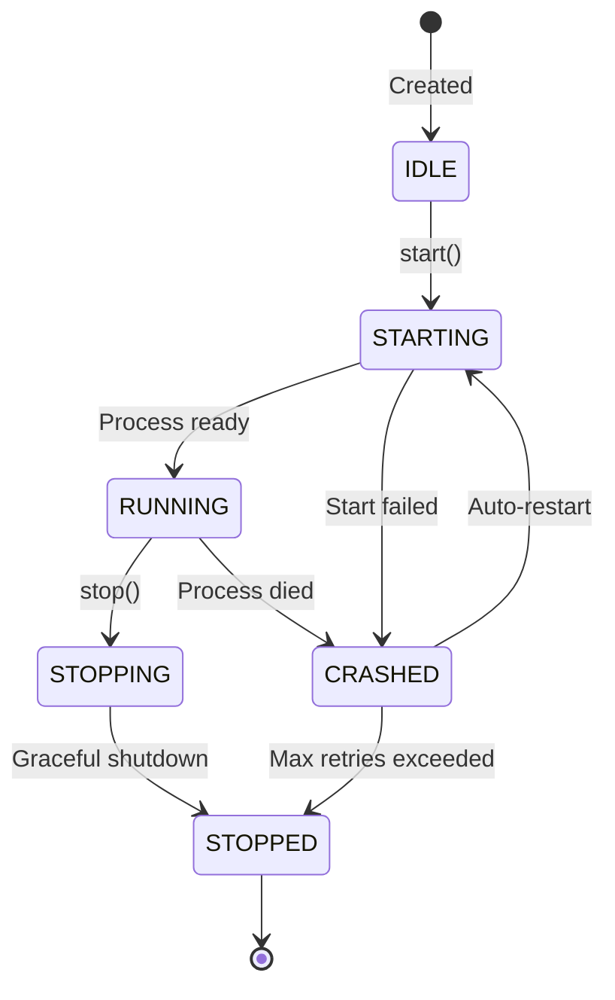
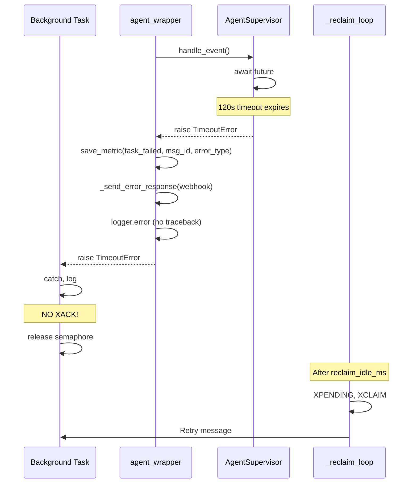
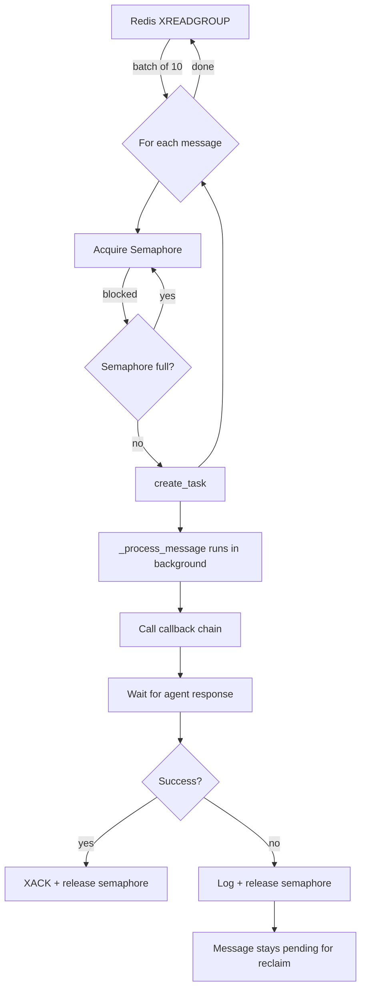

# Agent Supervisor Architecture

> **"Add your agent to the SDK, start it, and get production-grade reliability out of the box."**

The **Agent Supervisor** is the core component responsible for process isolation, lifecycle management, and error recovery in OmniDaemon.

## Process Boundaries

OmniDaemon runs each agent in its own isolated process, similar to a container. This ensures that one agent's failure does not impact the rest of the system.

```
┌─────────────────────────────────────────────────────────────────────────────┐
│                            HOST MACHINE                                     │
│                                                                             │
│  ┌───────────────────────────────────────────────────────────────────────┐  │
│  │                     OMNIDAEMON PROCESS (PID: 1234)                    │  │
│  │                                                                       │  │
│  │  ┌─────────────┐  ┌─────────────┐  ┌───────────────────────────────┐  │  │
│  │  │     SDK     │  │ AgentRunner │  │     RedisStreamEventBus       │  │  │
│  │  │  (facade)   │──│  (routing)  │──│  (consume, publish, reclaim)  │  │  │
│  │  └─────────────┘  └─────────────┘  └───────────────────────────────┘  │  │
│  │                           │                                           │  │
│  │           ┌───────────────┼───────────────┐                           │  │
│  │           │               │               │                           │  │
│  │           ▼               ▼               ▼                           │  │
│  │  ┌─────────────┐  ┌─────────────┐  ┌─────────────┐                    │  │
│  │  │ Supervisor1 │  │ Supervisor2 │  │ Supervisor3 │                    │  │
│  │  │   (stdio)   │  │   (stdio)   │  │   (stdio)   │                    │  │
│  │  └──────┬──────┘  └──────┬──────┘  └──────┬──────┘                    │  │
│  └─────────┼────────────────┼────────────────┼───────────────────────────┘  │
│            │                │                │                              │
│            ▼                ▼                ▼                              │
│  ┌─────────────────┐ ┌─────────────────┐ ┌─────────────────┐                │
│  │ AGENT PROCESS 1 │ │ AGENT PROCESS 2 │ │ AGENT PROCESS 3 │                │
│  │   (PID: 5678)   │ │   (PID: 5679)   │ │   (PID: 5680)   │                │
│  │                 │ │                 │ │                 │                │
│  │ ┌─────────────┐ │ │ ┌─────────────┐ │ │ ┌─────────────┐ │                │
│  │ │  Callback   │ │ │ │  Callback   │ │ │ │  Callback   │ │                │
│  │ │  Adapter    │ │ │ │  Adapter    │ │ │ │  Adapter    │ │                │
│  │ └─────────────┘ │ │ └─────────────┘ │ │ └─────────────┘ │                │
│  │ ┌─────────────┐ │ │ ┌─────────────┐ │ │ ┌─────────────┐ │                │
│  │ │ User Code   │ │ │ │ User Code   │ │ │ │ User Code   │ │                │
│  │ │ (LLM, DB)   │ │ │ │ (ML Model)  │ │ │ │ (API calls) │ │                │
│  │ └─────────────┘ │ │ └─────────────┘ │ │ └─────────────┘ │                │
│  └─────────────────┘ └─────────────────┘ └─────────────────┘                │
│                                                                             │
└─────────────────────────────────────────────────────────────────────────────┘
```

---

## Agent Supervisor Lifecycle

The supervisor manages the state of the agent process, handling startups, shutdowns, and crashes automatically.

### State Machine



### Internal Architecture

```
┌────────────────────────────────────────────────────────────────┐
│                      AgentSupervisor                           │
├────────────────────────────────────────────────────────────────┤
│                                                                │
│  State: RUNNING                                                │
│  Process PID: 5678                                             │
│  Restart Count: 0                                              │
│                                                                │
│  ┌──────────────────────────────────────────────────────────┐  │
│  │                    Background Tasks                       │  │
│  │                                                          │  │
│  │  ┌─────────────┐  ┌─────────────┐  ┌─────────────────┐   │  │
│  │  │_read_stdout │  │_stream_stderr│  │_run_heartbeat  │   │  │
│  │  │             │  │             │  │     _loop       │   │  │
│  │  │ Read JSON   │  │ Forward     │  │ Ping every 30s  │   │  │
│  │  │ responses   │  │ agent logs  │  │ Check health    │   │  │
│  │  │ Resolve     │  │ to logger   │  │ Auto-restart    │   │  │
│  │  │ futures     │  │             │  │ if needed       │   │  │
│  │  └─────────────┘  └─────────────┘  └─────────────────┘   │  │
│  └──────────────────────────────────────────────────────────┘  │
│                                                                │
│  ┌──────────────────────────────────────────────────────────┐  │
│  │                    Pending Requests                       │  │
│  │  {                                                       │  │
│  │    "req-123": Future<response>,                          │  │
│  │    "req-456": Future<response>,                          │  │
│  │  }                                                       │  │
│  └──────────────────────────────────────────────────────────┘  │
│                                                                │
│  ┌──────────────────────────────────────────────────────────┐  │
│  │                    stdio Communication                    │  │
│  │                                                          │  │
│  │  OmniDaemon ────stdin───▶ Agent Process                  │  │
│  │             ◀───stdout─── (JSON protocol)                │  │
│  │             ◀───stderr─── (logs)                         │  │
│  └──────────────────────────────────────────────────────────┘  │
│                                                                │
└────────────────────────────────────────────────────────────────┘
```

---

## Error & Timeout Handling

### Error Path



---

## Concurrency Model

### Flowchart



### Concurrency Limits

| Level | Control | Default |
|-------|---------|---------|
| Redis batch size | `XREADGROUP count` | 10 |
| Per-group concurrency | Semaphore | `consumer_count * 10` |
| Request timeout | `AgentProcessConfig.request_timeout` | 120s |
| Reclaim interval | `reclaim_interval` | 30s |
| Reclaim idle threshold | `reclaim_idle_ms` | 180,000ms (3 min) |
| DLQ retry limit | `dlq_retry_limit` | 3 |

---

## Resource Model

### I/O vs Compute Distribution

```
┌─────────────────────────────────────────────────────────────────────────┐
│                         RESOURCE ALLOCATION                             │
├─────────────────────────────────────────────────────────────────────────┤
│                                                                         │
│  OmniDaemon Process (I/O Bound - ~1% CPU)                               │
│  ┌───────────────────────────────────────────────────────────────────┐  │
│  │  ░░░░░░░░░░░░░░░░░░░░░░░░░░░░░░░░░░░░░░░░░░░░░░░░░░░░░░░░░░░░░░░  │  │
│  │  JSON parsing, async I/O, message routing                         │  │
│  │  Memory: ~50-100MB (buffers, futures, metadata)                   │  │
│  └───────────────────────────────────────────────────────────────────┘  │
│                                                                         │
│  Agent Processes (CPU/Memory Bound - 99% of work)                       │
│  ┌─────────────────────┐ ┌─────────────────────┐ ┌─────────────────────┐│
│  │████████████████████ │ │████████░░░░░░░░░░░░ │ │██████████████████░░ ││
│  │ Agent 1: LLM Agent  │ │ Agent 2: DB Agent   │ │ Agent 3: ML Agent   ││
│  │ CPU: 50% | 500MB    │ │ CPU: 10% | 100MB    │ │ CPU: 80% | 2GB      ││
│  └─────────────────────┘ └─────────────────────┘ └─────────────────────┘│
│                                                                         │
└─────────────────────────────────────────────────────────────────────────┘
```

### Isolation Benefits

| Failure Mode | Impact | Recovery |
|--------------|--------|----------|
| Agent 1 crashes | Other agents unaffected | Supervisor auto-restarts |
| Agent 2 memory leak | Only Agent 2 process grows | Kill + restart |
| Agent 3 high CPU | Other agents unaffected | OS scheduler handles |
| OmniDaemon crash | All agents orphaned | Restart OmniDaemon |
