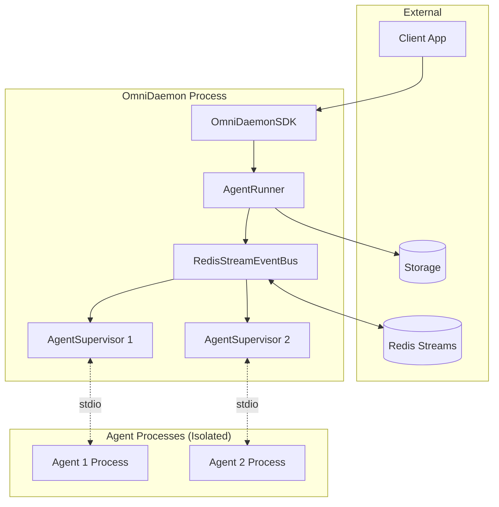

# System Architecture Overview

## Introduction

OmniDaemon is a **universal, event-driven runtime for AI agents** designed for enterprise-grade automation, scalability, and interoperability.

It's the foundational layer that turns AI intelligence into production-grade, event-driven systems.

---

## C4 Architecture Diagram

![OmniDaemon C4 Architecture](https://www.plantuml.com/plantuml/svg/bLLDR-Cs4BtxLx0v50uQHvUU2XHOVsInQP9TnNAswCcWf8b4c2Ar7DAxHj7_Neue4PQjo_faKdnlXZDl7Z-WvSQwHiv-4QgGhWHMMzlY7qbY-FVxIjZQvGx155fPKFQ-q4tIIgu8iq1RIf4dwzyNAMszlJmd3KSBnc_jrnx1XG9ptnB_B0M3MkqVVjWv4TwncmqSGUeM34kOtmQZk6JPoHCqD_xp6mAozVCZquOXg1APvNZ0czlPB1pQhxHJ9JUdkMwKA3aqMddS5x_OT8k1x9RzEsF-5rEQOtcuEBbvefZfoTPQqRyjL8AkWenNe2pUiTRbKc0DCOyBJkEKwkwruWXB0csxdJ5lvd8iZCY9HZCu-cCiTvxUmuTOLzIy5HxwQRTBsJ9zP1cOO-3zoD7w7VhxyAFL23q5etuPBTbHSBPzo7PNbE-yiDgS24Wvh1n-33lZTDS6kFMiCL6MdvWzjS3c1ag1oO6_7tYYkCN4y3mNjlbsUrqQG2SjUdgWqdQhZ5RiKLamFXSOXqsbgogUIs01obemIFrG1Lon5vAgGneWkH1yTo9L_SQsegXxAPc5Zo9KrIdgNPjOeL-Pxx_moVYFdlg_sMmMgKcjuPvxVtLAdVwpp1hW3HBp2o3o2jZAw4FVQfSdlidikx0rspo_tb4aT0qOLXdjMkhkE41NmZx0ikL53Uo9jgRvFucgNjZQKrLrwspV6UnIybUuOgVMzEIVbxkC_GKsv3zDlvRQbGiF4aTWJVTvYZNqUgXAjtXvdMPSlhocYvmZbCmdRGFRT96ZGcX5s2SuBRvowO1rSXaaFwYYyCMQogwj8bMgqLO6ijVdCDMIMw79Q3Ohsl2bS8LrFlp0IK1UmHMdLqcb8-qBhGB5HXUk0MK7Hj-_XYya85vJpdm2lVq5rMvfwhsfDboLI71IyEtPiU1KQoub3Wwq9_-Ptzxqbf1KstGzS7V7Xzcc-tvpWFPiVZkh-FhmURTVlMNxtJ_fGnykWgBUu_Xt8F7UpVsVuNFGsoKqAdaQsds-n0pwd8RGrql4I7iJcC67pceolbKwSdA2aaqEFXZ2HJkFm2lpjheL1Kx0H_ZGm6LmPIvbpej31tfKYzRe0l0guiWjCtw4GKans9c53k1pq7YQtZ3Mfz3gNLGazobOM_qyPZmMqx2BYlJF_z-GrreVs5otOIIZebdw9Tk5OC7SUIlY42J3Uvnqp_20wOzt9qCWGWIF7nv5jDowwzh7C6EdvoNsjkhNPEI3VyTtO5uA0uMzepTbePKyqSlt0LJf6la_)

<sub>**C4 Model Architecture Diagram** - System context and container-level view of OmniDaemon's architecture</sub>

## High-Level Overview



**Key Insight**: OmniDaemon is 99% I/O-bound. All heavy computation happens in isolated agent processes.

See also: [Agent Supervisor Architecture](agent-supervisor.mdx) | [Framework Comparison](../core-concepts/vs-other-frameworks.mdx)

## Core Architecture Principles

### 1. **Framework-Agnostic Design**

OmniDaemon works with **any** AI agent framework:
- **OmniCore Agent** (MCP tools, memory routing, event streaming)
- **Google ADK** (Gemini, LiteLLM, session management)
- **PydanticAI** (Type-safe agents with Pydantic models)
- **CrewAI** (Role-based multi-agent collaboration)
- **LangGraph** (Graph-based agent workflows)
- **AutoGen** (Conversational multi-agent systems)
- **Custom frameworks** (Any Python callable)

### 2. **Event-Driven by Design**

In modern enterprises, AI agents don't live in isolation. They need to:
- **Listen to events** from business systems
- **React to business triggers** in real-time
- **Collaborate across systems** (CRM, ERP, data pipelines)
- **Integrate with existing event architectures** (Kafka, RabbitMQ, Redis)

OmniDaemon provides the **infrastructure layer** that makes this possible.

### 3. **Pluggable Architecture**

OmniDaemon abstracts away:
- ✅ **Messaging** (Redis Streams, Kafka, RabbitMQ, NATS)
- ✅ **Persistence** (Redis, PostgreSQL, MongoDB, JSON)
- ✅ **Orchestration** (Event routing, retries, DLQ)

Into a unified, pluggable runtime.

---

## System Components

```
┌─────────────────────────────────────────────────────────────┐
│                      OmniDaemon SDK                         │
│  (Unified API for AI Agent Developers)                      │
└─────────────────────────────────────────────────────────────┘
                           │
        ┌──────────────────┼──────────────────┐
        │                  │                  │
        ▼                  ▼                  ▼
┌───────────────┐  ┌───────────────┐  ┌───────────────┐
│  Event Bus    │  │  Storage      │  │ Agent Runner  │
│  (Pluggable)  │  │  (Pluggable)  │  │  (Core)       │
└───────────────┘  └───────────────┘  └───────────────┘
        │                  │                  │
        │                  │                  │
┌───────┴────────┐  ┌──────┴───────┐  ┌──────┴───────┐
│ Redis Streams  │  │    Redis     │  │   Consumer   │
│ Kafka          │  │  PostgreSQL  │  │   Groups     │
│ RabbitMQ       │  │   MongoDB    │  │   Reclaim    │
│ NATS           │  │     JSON     │  │     DLQ      │
└────────────────┘  └──────────────┘  └──────────────┘
```

---

## Component Deep Dive

### 1. **OmniDaemon SDK**

The **unified API** that developers interact with.

**Key Methods:**
- `sdk.register_agent()` - Register AI agents to listen to topics
- `sdk.publish_task()` - Publish events to trigger agents
- `sdk.start()` - Start the agent runner
- `sdk.health()` - Monitor system health
- `sdk.get_metrics()` - Retrieve performance metrics

**Developer Experience:**
```python
from omnidaemon import OmniDaemonSDK
from omnidaemon import AgentConfig

sdk = OmniDaemonSDK()

async def my_agent(message):
    # Your AI agent logic here
    result = await ai_model.process(message["content"])
    return result

sdk.register_agent(
    agent_config=AgentConfig(
        name="MyAgent",
        topics=["user.requests"]
    ),
    callback=my_agent
)

await sdk.start()
```

---

### 2. **Event Bus Layer (Pluggable)**

Handles all event routing, delivery, and reliability.

**Current Implementation:**
- **Redis Streams** (production-ready, durable, consumer groups)

**Planned Support:**
- **Apache Kafka** (enterprise streaming)
- **RabbitMQ** (advanced routing)
- **NATS** (cloud-native, lightweight)
- **AWS SQS/SNS** (managed AWS services)
- **Azure Service Bus** (managed Azure services)
- **Google Pub/Sub** (managed GCP services)

**Features:**
- ✅ **Consumer Groups** - Load balancing across multiple agents
- ✅ **Message Acknowledgment** - Guaranteed delivery
- ✅ **Stream Replay** - Reprocess historical events
- ✅ **Dead Letter Queue (DLQ)** - Handle failed messages
- ✅ **Message Reclaim** - Auto-retry stalled messages
- ✅ **Monitoring** - Real-time event bus metrics

**See:** [Event Bus Architecture](../core-concepts/event-bus-architecture.md)

---

### 3. **Storage Layer (Pluggable)**

Handles persistence for agents, results, metrics, and configuration.

**Current Implementations:**
- **Redis** (fast, in-memory, production-ready)
- **JSON** (file-based, development/testing)

**Planned Support:**
- **PostgreSQL** (relational, ACID transactions)
- **MongoDB** (document store, flexible schema)
- **MySQL** (relational, legacy enterprise)
- **SQLite** (embedded, edge deployments)

**Stored Data:**
- **Agents** - Agent configurations and subscriptions
- **Results** - Task results (24-hour TTL)
- **Metrics** - Performance data (tasks processed, failed, latency)
- **Configuration** - Runtime configuration

**See:** [Storage Architecture](../core-concepts/storage-architecture.md)

---

### 4. **Agent Runner (Core)**

The runtime engine that executes AI agents.

**Responsibilities:**
1. **Subscribe to topics** via event bus
2. **Consume messages** from consumer groups
3. **Invoke callbacks** (your AI agent)
4. **Handle errors** (retries, DLQ)
5. **Track metrics** (latency, throughput)
6. **Reclaim stalled messages** (auto-recovery)

**Key Features:**
- ✅ **Asynchronous execution** (non-blocking I/O)
- ✅ **Graceful shutdown** (cleanup on Ctrl+C)
- ✅ **Health monitoring** (runtime status, uptime)
- ✅ **Multi-topic support** (one agent, multiple topics)
- ✅ **Idempotency** (correlation IDs for deduplication)

---

## Data Flow

### Event Publishing Flow

```
┌──────────┐
│Publisher │ (Your application)
└────┬─────┘
     │ 1. sdk.publish_task()
     ▼
┌─────────────┐
│ Event Bus   │ (Redis/Kafka/RabbitMQ)
│  (Topic)    │
└─────┬───────┘
      │ 2. Message stored in stream
      ▼
┌──────────────┐
│ Consumer     │ (Agent's consumer group)
│ Group        │
└──────────────┘
```

### Agent Processing Flow

```
┌──────────────┐
│ Consumer     │
│ Group        │
└──────┬───────┘
       │ 1. Agent runner polls
       ▼
┌──────────────┐
│ Agent Runner │
└──────┬───────┘
       │ 2. Invoke callback
       ▼
┌──────────────┐
│ Your AI      │ (OmniCore, Google ADK, etc.)
│ Agent        │
└──────┬───────┘
       │ 3. Return result
       ▼
┌──────────────┐
│ Storage      │ (Save result)
└──────┬───────┘
       │ 4. Acknowledge message
       ▼
┌──────────────┐
│ Event Bus    │ (Remove from pending)
└──────────────┘
```

---

## Failure Handling Architecture

### Retry Mechanism

```
Message arrives
    │
    ▼
Try 1: Process ───► Success ───► ACK ───► Done
    │
    └──► Fail ───► Retry (backoff)
            │
            ▼
Try 2: Process ───► Success ───► ACK ───► Done
    │
    └──► Fail ───► Retry (backoff)
            │
            ▼
Try 3: Process ───► Success ───► ACK ───► Done
    │
    └──► Fail ───► Move to DLQ
                        │
                        ▼
                    Manual Review
```

**Key Features:**
- ✅ Exponential backoff between retries
- ✅ Configurable retry limits
- ✅ DLQ for persistent failures
- ✅ Manual DLQ inspection and replay

---

## Scalability Architecture

### Horizontal Scaling (Multiple Runners)

```
┌─────────────┐
│ Event Bus   │
│  (Topic)    │
└──────┬──────┘
       │
       ├────────┬────────┬────────┐
       │        │        │        │
       ▼        ▼        ▼        ▼
   ┌────┐   ┌────┐   ┌────┐   ┌────┐
   │ R1 │   │ R2 │   │ R3 │   │ R4 │  (Agent Runners)
   └────┘   └────┘   └────┘   └────┘
       │        │        │        │
       └────────┴────────┴────────┘
                  │
            Consumer Group
       (Load balancing automatic)
```

**Benefits:**
- ✅ Add more runners to scale throughput
- ✅ Automatic load balancing via consumer groups
- ✅ No code changes required
- ✅ Fault tolerance (runner crash = auto-reassignment)

### Vertical Scaling (Async Processing)

Each agent runner processes messages **asynchronously**:
- Multiple messages processed concurrently
- Non-blocking I/O for API calls
- Efficient resource utilization

---

## Deployment Architectures

### 1. **Single Server (Development/Small Scale)**

```
┌─────────────────────────────────┐
│        Single Server            │
│                                 │
│  ┌──────┐   ┌─────────────┐   │
│  │Redis │   │Agent Runner │   │
│  └──────┘   └─────────────┘   │
│                                 │
└─────────────────────────────────┘
```

### 2. **Multi-Server (Production)**

```
┌──────────┐     ┌──────────┐     ┌──────────┐
│ Runner 1 │     │ Runner 2 │     │ Runner 3 │
└────┬─────┘     └────┬─────┘     └────┬─────┘
     │                │                │
     └────────────────┼────────────────┘
                      │
              ┌───────┴────────┐
              │  Redis Cluster │
              └────────────────┘
```

### 3. **Enterprise (Cloud/Hybrid)**

```
┌──────────────────────────────────────────┐
│            Load Balancer                 │
└──────────────┬───────────────────────────┘
               │
    ┌──────────┼──────────┐
    │          │          │
    ▼          ▼          ▼
┌────────┐ ┌────────┐ ┌────────┐
│Runner  │ │Runner  │ │Runner  │  (Auto-scaling)
│Pod 1   │ │Pod 2   │ │Pod N   │
└───┬────┘ └───┬────┘ └───┬────┘
    │          │          │
    └──────────┼──────────┘
               │
    ┌──────────┴──────────┐
    │                     │
    ▼                     ▼
┌─────────┐         ┌──────────┐
│  Kafka  │         │PostgreSQL│  (Managed services)
│ Cluster │         │  Cluster │
└─────────┘         └──────────┘
```

---

## Security Architecture

### 1. **Authentication & Authorization**

- **Event Bus:** Connection credentials (Redis password, Kafka SASL, etc.)
- **Storage:** Database authentication
- **API:** Optional API key authentication (future)

### 2. **Network Security**

- **TLS/SSL:** Encrypted connections to Redis/Kafka
- **VPC/Private Networks:** Isolated network segments
- **Firewall Rules:** Restrict access to event bus and storage

### 3. **Data Security**

- **Encryption at Rest:** Storage backend encryption
- **Encryption in Transit:** TLS for all connections
- **PII Handling:** GDPR/HIPAA compliance via tenant isolation

### 4. **Multi-Tenancy**

```python
# Tenant isolation via tenant_id
await sdk.publish_task(
    topic="user.request",
    tenant_id="customer-123",  # Isolate per customer
    payload=PayloadBase(content=data)
)

# Agent callback receives tenant context
async def my_agent(message):
    tenant_id = message["tenant_id"]
    # Load tenant-specific config/data
    config = load_tenant_config(tenant_id)
```

---

## Observability Architecture

### 1. **Metrics** (`sdk.get_metrics()`)

```python
{
    "topic.name": {
        "agent.name": {
            "tasks_received": 1250,
            "tasks_processed": 1200,
            "tasks_failed": 50,
            "avg_processing_time_ms": 340.5
        }
    }
}
```

### 2. **Health Monitoring** (`sdk.health()`)

```python
{
    "status": "running",
    "uptime_seconds": 3600,
    "runner_id": "RUNNER_abc123",
    "event_bus": {"status": "healthy", "type": "redis"},
    "storage": {"status": "healthy", "type": "redis"}
}
```

### 3. **CLI Monitoring**

```bash
omnidaemon health       # System health
omnidaemon metrics      # Performance metrics
omnidaemon bus list     # Event bus streams
omnidaemon bus dlq      # Dead letter queue
```

### 4. **Integration with Monitoring Tools** (Future)

- **Prometheus** - Metrics export
- **Grafana** - Dashboards
- **DataDog** - APM integration
- **New Relic** - Observability platform

---

## Configuration Management

### Environment-Based Configuration

```bash
# Event Bus
EVENT_BUS_TYPE=redis_stream
REDIS_URL=redis://localhost:6379

# Storage
STORAGE_BACKEND=redis

# Runtime
OMNIDAEMON_LOG_LEVEL=INFO
OMNIDAEMON_RECLAIM_INTERVAL=60
OMNIDAEMON_DLQ_RETRY_LIMIT=3
```

### Dynamic Configuration (via SDK)

```python
# Save runtime configuration
await sdk.save_config("max_retries", 5)

# Retrieve configuration
config = await sdk.get_config("max_retries")
```

---

## Performance Characteristics

### Throughput

- **Redis Streams:** 10,000+ messages/sec per runner
- **Kafka:** 100,000+ messages/sec (horizontal scaling)
- **Latency:** < 10ms overhead (excluding AI agent processing)

### Resource Usage

- **Memory:** ~50-100MB per runner (excluding AI models)
- **CPU:** Async I/O = efficient utilization
- **Network:** Dependent on event bus backend

### Scalability Limits

- **Runners:** Unlimited (horizontal scaling)
- **Topics:** Unlimited
- **Message Size:** Limited by event bus (Redis: 512MB, Kafka: 1MB default)

---

## Technology Stack

### Core Dependencies

- **Python 3.10+** - Runtime language
- **asyncio** - Asynchronous I/O
- **Pydantic** - Data validation and schemas
- **FastAPI** - REST API (optional)
- **Typer** - CLI interface
- **Rich** - Terminal UI

### Event Bus Integrations

- **redis-py** - Redis Streams client
- **aiokafka** - Kafka client (planned)
- **aio-pika** - RabbitMQ client (planned)

### Storage Integrations

- **redis-py** - Redis client
- **asyncpg** - PostgreSQL client (planned)
- **motor** - MongoDB client (planned)

---

## Design Patterns

### 1. **Dependency Injection**

OmniDaemon uses DI for event bus and storage:

```python
# Module-level instances (src/omnidaemon/event_bus/__init__.py)
_event_bus_instance = None

def get_event_bus() -> BaseEventBus:
    global _event_bus_instance
    if _event_bus_instance is None:
        _event_bus_instance = create_event_bus()
    return _event_bus_instance
```

### 2. **Strategy Pattern**

Pluggable backends via abstract interfaces:

```python
class BaseEventBus(ABC):
    @abstractmethod
    async def publish(self, topic, payload): ...

    @abstractmethod
    async def subscribe(self, topic, consumer_group, callback): ...

# Concrete implementations
class RedisStreamEventBus(BaseEventBus): ...
class KafkaEventBus(BaseEventBus): ...  # Future
```

### 3. **Observer Pattern**

Event-driven architecture at its core:

```python
# Publishers emit events
await sdk.publish_task(topic="user.signup", payload=data)

# Agents observe and react
sdk.register_agent(topics=["user.signup"], callback=send_welcome_email)
```

---

## Architecture Decision Records (ADRs)

### ADR-001: Why Event-Driven?

**Context:** AI agents need to react to business events in real-time.

**Decision:** Use event-driven architecture instead of polling or HTTP webhooks.

**Consequences:**
- ✅ Decoupling between publishers and agents
- ✅ Natural scaling via consumer groups
- ✅ Built-in reliability (retries, DLQ)
- ❌ Requires event bus infrastructure

### ADR-002: Why Pluggable Backends?

**Context:** Enterprises have diverse infrastructure (Redis, Kafka, on-prem, cloud).

**Decision:** Abstract event bus and storage behind interfaces.

**Consequences:**
- ✅ Works in any environment
- ✅ No vendor lock-in
- ✅ Easy migration between backends
- ❌ More complex codebase

### ADR-003: Why Python?

**Context:** AI/ML ecosystem is primarily Python.

**Decision:** Build OmniDaemon in Python for seamless AI framework integration.

**Consequences:**
- ✅ Easy integration with AI models
- ✅ Rich ecosystem of libraries
- ✅ Developer-friendly
- ❌ Python's GIL (mitigated by asyncio)

---

## Future Architecture Enhancements

### Planned Features

1. **Workflow Orchestration**
   - Multi-step agent pipelines
   - Conditional routing
   - Fan-out/fan-in patterns

2. **Advanced Monitoring**
   - Prometheus metrics export
   - OpenTelemetry tracing
   - Custom dashboards

3. **Enhanced Security**
   - API authentication
   - RBAC for agents
   - Audit logging

4. **Multi-Cloud Support**
   - AWS SQS/SNS, Lambda
   - Azure Service Bus, Functions
   - GCP Pub/Sub, Cloud Run

5. **Edge Deployment**
   - SQLite storage backend
   - Local event bus (file-based)
   - Offline-first agents

---

## Related Documentation

- **[Event-Driven Architecture](../core-concepts/event-driven-architecture.md)** - Why event-driven AI?
- **[Event Bus Architecture](../core-concepts/event-bus-architecture.md)** - Event bus implementation details
- **[Storage Architecture](../core-concepts/storage-architecture.md)** - Storage layer deep dive
- **[Pluggable Architecture](../core-concepts/pluggable-architecture.md)** - How to swap backends

---

**Next:** [Enterprise Use Cases](../enterprise/use-cases.md) | [Deployment Guide](../enterprise/deployment.md)
