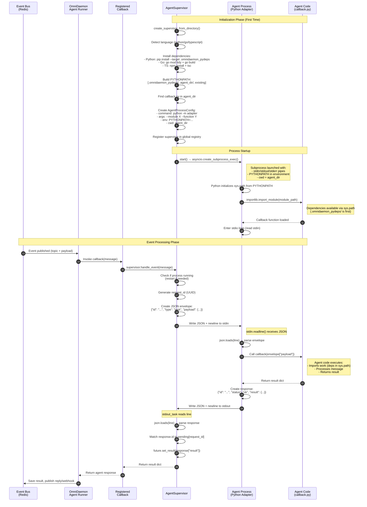

# Complete Agent Process Flow

This document details the complete flow from OmniDaemon event to agent response, including dependency management, process startup, and JSON communication.

## Process Architecture

```
┌─────────────────────────────────────────────────────────────┐
│  Agent Runner Process (PID: 12345)                          │
│  ┌───────────────────────────────────────────────────────┐  │
│  │  OmniDaemon SDK                                       │  │
│  │  - Event Bus (Redis)                                  │  │
│  │  - Agent Registration                                 │  │
│  └───────────────────────────────────────────────────────┘  │
│  ┌───────────────────────────────────────────────────────┐  │
│  │  Registered Callback                                  │  │
│  │  async def call_omnicore_agent(message):              │  │
│  │      supervisor = await get_supervisor()               │  │
│  │      return await supervisor.handle_event(message)     │  │
│  └───────────────────────────────────────────────────────┘  │
│  ┌───────────────────────────────────────────────────────┐  │
│  │  AgentSupervisor                                       │  │
│  │  - Manages subprocess lifecycle                       │  │
│  │  - Handles stdio communication                         │  │
│  │  - Restarts on crash                                   │  │
│  └───────────────────────────────────────────────────────┘  │
│                    │                                        │
│                    │ stdin/stdout/stderr pipes              │
│                    ▼                                        │
└─────────────────────────────────────────────────────────────┘
                    │
                    │ asyncio.create_subprocess_exec()
                    │ (Separate Process!)
                    ▼
┌─────────────────────────────────────────────────────────────┐
│  Agent Process (PID: 12346) - SEPARATE PROCESS              │
│  ┌───────────────────────────────────────────────────────┐  │
│  │  Python Callback Adapter                              │  │
│  │  - Reads JSON from stdin                              │  │
│  │  - Imports callback module                            │  │
│  │  - Calls callback function                            │  │
│  │  - Writes JSON to stdout                              │  │
│  └───────────────────────────────────────────────────────┘  │
│  ┌───────────────────────────────────────────────────────┐  │
│  │  Agent Code (callback.py)                             │  │
│  │  - Has access to dependencies via PYTHONPATH            │  │
│  │  - Runs in isolated process                            │  │
│  │  - Can crash without affecting runner                  │  │
│  └───────────────────────────────────────────────────────┘  │
└─────────────────────────────────────────────────────────────┘
```

**Key Points:**
- ✅ **Different PIDs**: Runner (12345) vs Agent (12346) - completely separate processes
- ✅ **stdio Pipes**: Communication via stdin/stdout/stderr (no network, no shared memory)
- ✅ **Isolation**: Agent crashes don't affect runner, memory is separate
- ✅ **Adapter Pattern**: The adapter bridges stdio JSON ↔ Python callback function

## Complete Sequence Diagram



## Detailed Component Breakdown

### 1. Supervisor Initialization (`create_supervisor_from_directory`)

**For Python Agents:**
```python
# Step 1: Install dependencies
python_env = _ensure_python_dependencies(agent_path)
# Returns: {"PYTHONPATH": ".omnidaemon_pydeps/:agent_dir/:existing", "PYTHONNOUSERSITE": "1"}

# Step 2: Find callback
module_path, func_name = _find_callback_in_directory(
    agent_dir, callback_function, "python", python_env=python_env
)
# Returns: ("examples.omnicoreagent_dir.agents.omnicore_agent.callback", "call_file_system_agent")

# Step 3: Create config
config = AgentProcessConfig(
    command="python",
    args=["-m", "omnidaemon.agent_runner.python_callback_adapter", 
          "--module", module_path, "--function", func_name],
    env=python_env,  # Includes PYTHONPATH
    cwd=str(agent_path),  # Working directory
)
```

### 2. Process Launch (`supervisor.start()`)

```python
# Launches subprocess with:
process = await asyncio.create_subprocess_exec(
    "python",
    "-m", "omnidaemon.agent_runner.python_callback_adapter",
    "--module", "examples.omnicoreagent_dir.agents.omnicore_agent.callback",
    "--function", "call_file_system_agent",
    stdin=asyncio.subprocess.PIPE,
    stdout=asyncio.subprocess.PIPE,
    stderr=asyncio.subprocess.PIPE,
    cwd="/app/examples/omnicoreagent_dir/agents/omnicore_agent",
    env={"PYTHONPATH": "/app/.../.omnidaemon_pydeps:/app/.../omnicore_agent:..."}
)
```

### 3. Python Callback Adapter (Subprocess)

**Initialization:**
```python
# Adapter starts, Python initializes sys.path from PYTHONPATH
# sys.path = [
#     "/app/.../.omnidaemon_pydeps",  # Dependencies first!
#     "/app/.../omnicore_agent",      # Agent code
#     ...existing paths...
# ]

# Load callback module
module = importlib.import_module("examples.omnicoreagent_dir.agents.omnicore_agent.callback")
callback = getattr(module, "call_file_system_agent")
# ✅ All imports in callback.py work because deps are in sys.path
```

**Event Loop:**
```python
while True:
    line = await loop.run_in_executor(None, sys.stdin.readline)
    envelope = json.loads(line)
    # {"id": "abc-123", "type": "task", "payload": {...}}
    
    result = await callback(envelope["payload"])
    # Agent code executes, returns dict
    
    response = {
        "id": envelope["id"],
        "status": "ok",
        "result": result
    }
    print(json.dumps(response))  # stdout
```

### 4. Communication Protocol

**Request Format (Supervisor → Adapter):**
```json
{
  "id": "550e8400-e29b-41d4-a716-446655440000",
  "type": "task",
  "payload": {
    "content": "List all files",
    "topic": "file_system.omnicore.tasks",
    "task_id": "...",
    ...
  }
}
```

**Response Format (Adapter → Supervisor):**
```json
{
  "id": "550e8400-e29b-41d4-a716-446655440000",
  "status": "ok",
  "result": {
    "status": "success",
    "data": "File listing: ..."
  }
}
```

**Error Response:**
```json
{
  "id": "550e8400-e29b-41d4-a716-446655440000",
  "status": "error",
  "error": "Error message here"
}
```

## Key Points

1. **Process Isolation**: Each agent runs in a **separate process (different PID)** from the agent runner. The supervisor uses `asyncio.create_subprocess_exec()` to spawn the agent process, which means:
   - Agent runner PID: e.g., `12345` (main OmniDaemon process)
   - Agent process PID: e.g., `12346` (separate Python subprocess)
   - Complete isolation: Agent crashes don't affect the runner, and vice versa
   - Memory isolation: Each agent has its own memory space

2. **Communication via stdio**: The agent process communicates with the supervisor through:
   - **stdin**: Supervisor writes JSON requests → Agent reads
   - **stdout**: Agent writes JSON responses → Supervisor reads
   - **stderr**: Agent logs → Supervisor streams to logger
   - No network sockets, no shared memory - just standard pipes

3. **Dependency Isolation**: Each agent's dependencies are installed in `.omnidaemon_pydeps/` within the agent directory, isolated from other agents and the main process.

4. **PYTHONPATH Setup**: The supervisor builds PYTHONPATH with dependencies first, then agent directory, ensuring imports resolve correctly.

5. **Process Persistence**: The agent process runs continuously, handling multiple events without restarting (unless it crashes).

6. **JSON over stdio**: All communication uses newline-delimited JSON, making it language-agnostic and simple.

7. **Request/Response Correlation**: Each request has a unique `id` that matches the response, allowing async handling of multiple concurrent requests.

8. **Error Handling**: If the process crashes, the supervisor can restart it (if `restart_on_exit=True`).

## Testing the Flow

```bash
# Start the agent runner
uv run examples/omnicoreagent_dir/supervised_agent_runner.py

# In another terminal, publish a test event
uv run examples/omnicoreagent_dir/filesystem_publisher.py "List all files"

# Watch the logs to see:
# 1. Supervisor installing dependencies (first time)
# 2. Process starting
# 3. JSON messages flowing through stdio
# 4. Agent processing and responding
```

