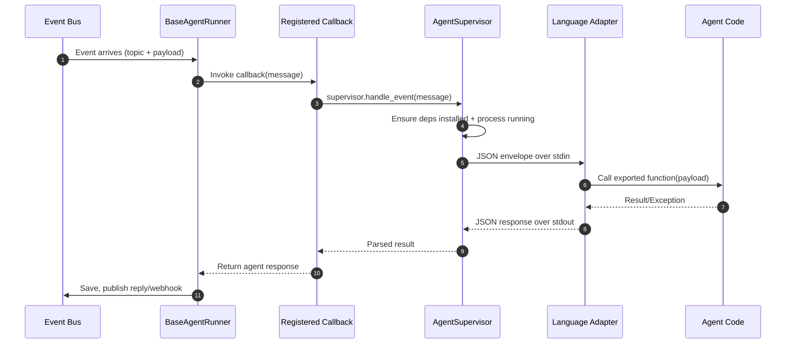

# Agent Supervisor Flow & Dependency Bootstrapping

This note summarizes the end-to-end sequence each time an event hits OmniDaemon’s agent runner. 

> **Note:** Currently only Python agents are supported. This document describes the planned architecture for Python, Go, and TypeScript agents.

## High-Level Sequence



## Supervisor Checklist per Language

| Language | Dependency Prep | Build Step | Adapter Command |
| --- | --- | --- | --- |
| **Python** | Detect `requirements.txt` or `pyproject.toml`. `pip install --target .omnidaemon_pydeps` (cached by hash). | N/A (ready-to-run). | `python -m omnidaemon.agent_runner.python_callback_adapter --module … --function …` |
| **Go** | `go mod tidy` | `go build -o <temp>/agent .` | Runs compiled binary directly. |
| **TypeScript / JavaScript** | Detect lockfile -> `npm/yarn/pnpm install` (cached). | `npm run build` if present, otherwise `npx tsc`. | `node ts_callback_adapter/dist/index.js --module <compiled.js> --function <export>` |

> ✅ Dependency installs/builds happen inside the agent directory, so each agent is self-contained. Restarts reuse cached installs as long as manifests/lock files don’t change.

## What the Callback Author Provides

Minimal contract for each agent:

1. **Directory** containing:
   - Entry callback module (Python `.py`, Go `.go`, or TypeScript/JavaScript `.ts/.js`).
   - Dependency manifest (`requirements.txt`, `pyproject.toml`, `package.json`, `go.mod`, etc.).
2. **Callback function name** to forward to `create_supervisor_from_directory`.
3. Optional `.env` next to the agent for secrets the supervisor should inject.

## Sample Declaration (Python)

```python
async def call_omnicore_agent(message: Dict[str, Any]):
    supervisor = await create_supervisor_from_directory(
        agent_name="omnicore",
        agent_dir="examples/omnicoreagent_dir/agents/omnicore_agent",
        callback_function="call_file_system_agent",
    )
    return await supervisor.handle_event(message)
```

`requirements.txt` and/or `pyproject.toml` should live in the same folder; the supervisor installs them into `.omnidaemon_pydeps` before starting the adapter.

## Sample Declaration (TypeScript)

```
examples/my_ts_agent/
├── package.json          # includes scripts.build or tsconfig
├── package-lock.json     # (or yarn.lock / pnpm-lock.yaml)
├── src/
│   └── callback.ts       # export async function handleEvent(payload)
└── tsconfig.json
```

```typescript
export async function handleEvent(payload: Record<string, unknown>) {
  // Agent logic
  return { status: "success", data: "Hello from TS!" };
}
```

```python
await create_supervisor_from_directory(
    agent_name="ts_agent",
    agent_dir="examples/my_ts_agent",
    callback_function="handleEvent",
)
```

The supervisor:
1. Runs `npm ci` (or `yarn/pnpm install`).
2. Executes `npm run build` or `npx tsc`.
3. Discovers `dist/index.js` (or `main` field) and starts the TypeScript adapter.

## Verifying Locally

```bash
# Example: run the supervised agent runner demo
uv run examples/omnicoreagent_dir/supervised_agent_runner.py

# Publish a test event (see publisher scripts in examples/)
uv run examples/omnicoreagent_dir/filesystem_publisher.py
uv run examples/omnicoreagent_dir/go_agent_publisher.py
uv run examples/omnicoreagent_dir/google_adk_publisher.py
```

Supervisors log install/build progress the first time they spin up each agent so you can confirm the dependency bootstrap is working.

